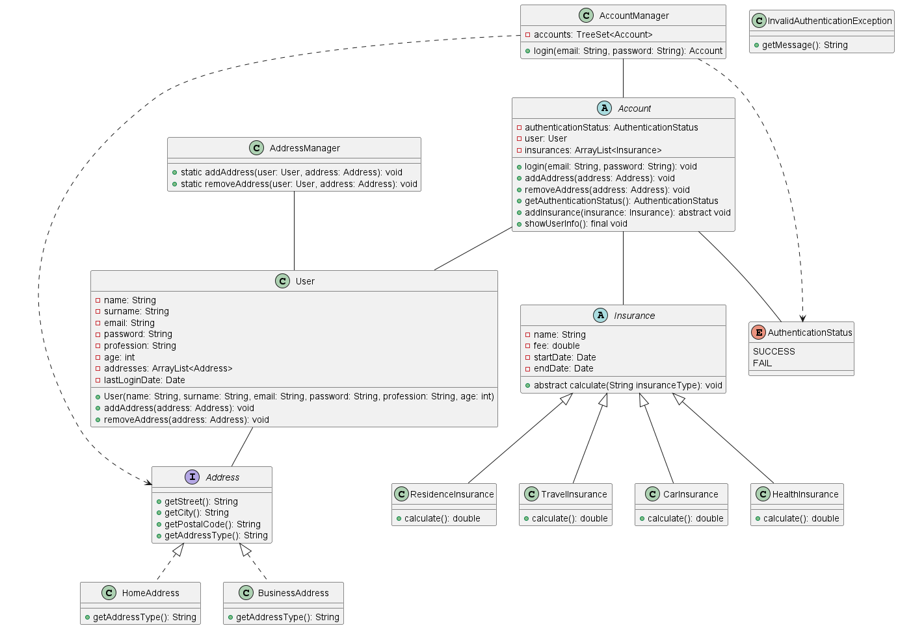

# Insurance-Management-System

Imagine that you are developing software for an insurance company. The company has two types of customer profiles: "Individual" and "Enterprise". Design an abstract class called "Account" to represent the customer profile. The "Account" class will hold all the customer information after logging into the system. Inside the "Account" class, there will be a reference to an object of type "User" (aggregation relationship).

- The "User" class represents the personal information of the customer. In the "User" class, the following information about the customer should be included:
  - Name (String)
  - Surname (String)
  - Email (String)
  - Password (String)
  - Profession (String)
  - Age (int)
  - List of addresses ('ArrayList<Address'>)
  - Last login date (Date)

- Additionally, the "User" class will have a list to store addresses of type ArrayList. The address information will have two types: Home address ("HomeAddress") and Business address ("BusinessAddress"). Design two classes that implement the "Address" interface. You have the freedom to decide which functions should be included in the "Address" interface.

- Design a class called "AddressManager" responsible for adding and removing customer addresses. This class should have two static functions that allow adding and removing elements from the address list of the "User" object. You can decide on the function names.

- In the "Account" class, define a final function called "showUserInfo" that prints the customer information to the screen without returning a value.

- In the "Account" class, store the insurance policies that customers have taken out as a list. Design an abstract class called "Insurance" to represent the insurance policy. This abstract class will have the following variables:

  - Name of the insurance (String)
  - Fee of the insurance (double)
  - Start and end dates of the insurance (Date)

- In addition, define an abstract function called "calculate" that will be implemented in the subclasses mentioned below.

- Derive the following subclasses from this abstract class:

  - "HealthInsurance" (private health insurance)
  - "ResidenceInsurance" (home insurance)
  - "TravelInsurance" (travel insurance)
  - "CarInsurance" (car insurance)

- Each subclass will override the abstract function "calculate" to calculate the insurance fee according to its own rules.

- Based on the above definitions, the abstract class "Account" should include the following:

  - Login status of the user (AuthenticationStatus)
  - User object
  - List of insurances taken by the user (ArrayList<Insurance>)

- Define an enum called "AuthenticationStatus" with two constants: SUCCESS and FAIL. SUCCESS will be used when the login process is successful, and FAIL will be used when the user is not logged in.

- Define a function in the "Account" class that allows the user to log in to their account. This function should take the email and password as parameters and compare them with the email and password in the "User" class. If the entered information is correct, the login process will be successful, and the login status of the user will be set to SUCCESS. If the login process fails, throw an "InvalidAuthenticationException" as a custom exception. Note that you need to write this exception class by inheriting from the Exception class in Java.

- Define non-abstract functions in the "Account" class to add and remove addresses of the user and a function to return the login status of the user.

- Define an abstract function in the "Account" class to allow the user to add an insurance policy. This abstract function will be overridden in the subclasses "Individual" and "Enterprise" to provide their own implementation. This is because the profit margin applied to the prices of the packages added by individual and enterprise customers will be different.

- The subclasses "Individual" and "Enterprise" will inherit from the "Account" class.

- Design a class called "AccountManager". This class should have a TreeSet data structure to store the created individual and enterprise accounts. Implement a function called "login" in this class. This function will take the email and password as parameters, search the Account list, and if a matching login is found, it will return the Account object to the caller. This function will call the "login" function on the Account object. Remember that this function can throw an "InvalidAuthenticationException" exception, so make sure to implement the try-catch mechanism.

- Since we will be storing objects of the "Account" class in a TreeSet, ensure that the "Account" class implements the "Comparable" interface. Also, remember to implement the "hashCode" and "equals" functions in the "Account" class.

- Design a class that takes email and password information from the keyboard. Call the "login" function in the AccountManager class with the entered email and password. If a valid user logs in, this function will return an object of type Account.

Note: Please keep in mind that this translation may not be perfect, and it's always a good idea to review and adapt the code according to your specific needs.
## Uml Class Diagram

(You can check it from test.puml file.)